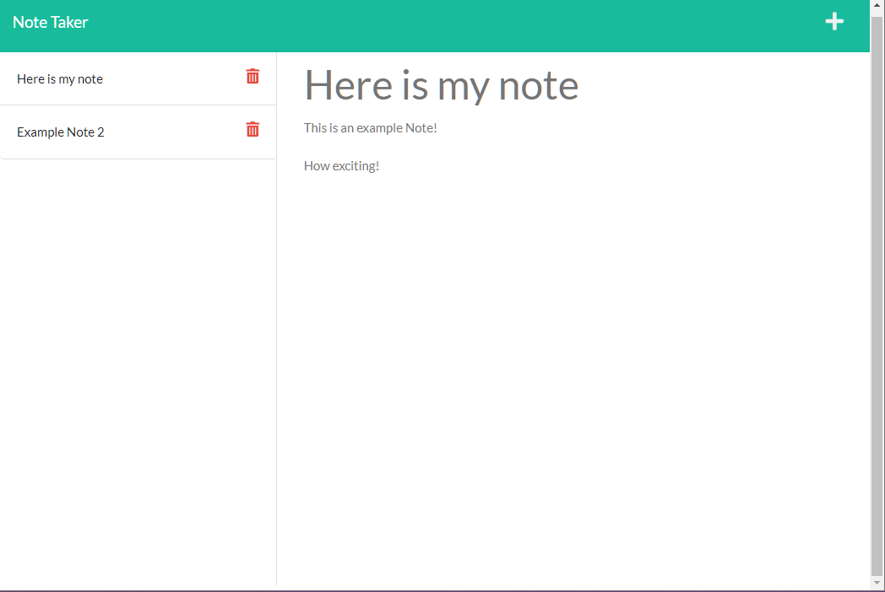

# Express Note Taker
  
  ## Description
  An express app that allows users to create and save notes for themselves.

  ## Installation
  Either:
  A) Clone the repo. Then run `npm install` in the main folder.

  or

  B) Simply access the site [here](ae-express-note-taker.herokuapp.com)

  ## Usage (if cloned)
  Open the terminal, then run `node server.js` to start the application. Enter a title and text to a note, then click the save icon to save a new note.

  ## Demo Image
  

  ## License 
  

